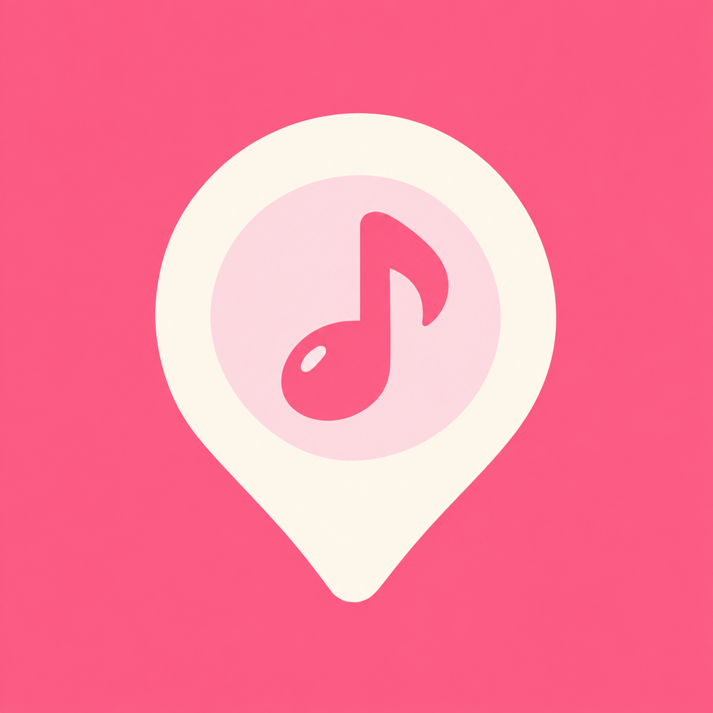

  

  

  
  
  

<b>Fill your own map with music.</b>

An archive app that pins the music tied to a place onto your map.

Drop one song and a short note wherever you are. As the entries pile up, the map
turns into your own timeline of music. No account, no friends, no feed —
everything stays on your device.

## Stack

| Area | Choice |
|---|---|
| Minimum version | iOS 17.0+ |
| UI | SwiftUI |
| State | `@Observable` (iOS 17 Observation) |
| Local storage | SwiftData |
| Map | MapKit (`Map(position:)` + `Annotation`) |
| Music data | iTunes Search API |
| Audio | AVPlayer (30s preview) |
| Payments | RevenueCat |
| Backend | None. Fully local |

## Progress

- [x] **1** Project setup + SwiftData `Entry` model + 3 dummy entries → *three pins show on the map*
- [x] **2** RecordSheet (text input only) → save → *core loop complete*
- [x] **3** iTunes Search API + preview playback → *the chosen song's artwork becomes a pin*
- [x] **4** Location permission + coordinates + reverse geocoding → *pins land on my actual location*
- [x] **5** EntryDetailView + edit/delete → *CRUD complete*
- [x] **6** Bottom sheet + weekly strip + list/calendar → *home screen complete*
- [x] **7** Share card → *an image comes out*
- [x] **8** RevenueCat + paywall + gating → *sandbox purchase goes through*
- [x] **9** Onboarding / settings / empty states / error handling → *a first-time user doesn't get lost*
- [x] **10** Widget · recall notifications (if time allows)

## Screens

**P0** — HomeMapView · RecordSheet · SongSearchView · EntryDetailView
**P1** — EntryListView / CalendarView · ShareCardView · PaywallView · SettingsView
**P2** — Widget · geofence recall notifications · onboarding
